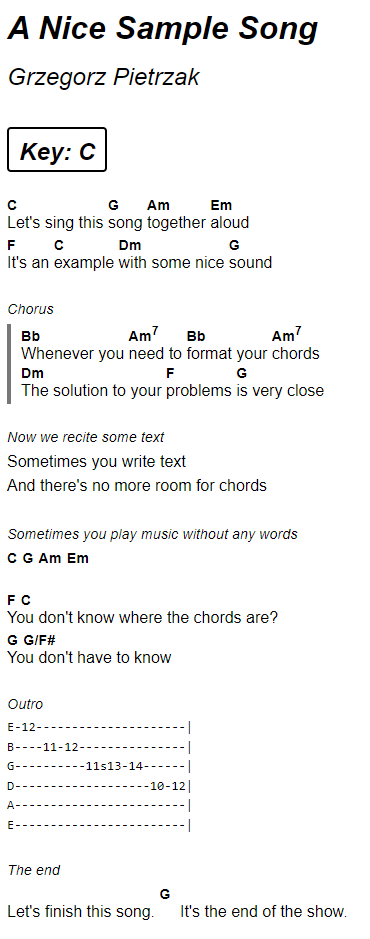

# The chordpro-php library 🎸


A simple tool to parse, transpose & format [ChordPro](https://www.chordpro.org) songs with lyrics & chords. Compatible with PHP 8.1 and above.

_Forked from <https://github.com/nicolaswurtz/chordpro-php> by [Nicolaz Wurtz](https://github.com/nicolaswurtz), on LGPL-3 license._

The following output formats are currently supported:

- **HTML** (verses contain blocks with embedded `span` for aligning chords with lyrics).
- **JSON** (verses are arrays of chords and lyrics for alignment purposes).
- **Plain text** (chords are aligned with monospace text thanks to whitespace).

The library provides some extra functionality:

- Tranpose chords by semitones or to the target key.
- Parse and display various chord notations:
  - French (`Do`, `Ré`, `Mi`).
  - German (`Fis`, `a`).
  - With UTF characters (`A♭`, `F♯`).
- Guess the key of a song.

## Installation

Via composer:

``` bash
composer require intelektron/chordpro-php
```

## Usage

See [web/example.php](web/example.php) for demo with CSS styling.

``` php
<?php

require __DIR__ . '/vendor/autoload.php';

$txt = "{t:A Nice Sample Song}
{st:Grzegorz Pietrzak}
{key:C}

# Let's start it!
[C]Let's sing this [G]song [Am]together [Em]aloud
[F]It's an [C]example [Dm]with some nice [G]sound

{soc: Chorus}
[Bb]Whenever you [Am7]need to [Bb]format your [Am7]chords
[Dm]The solution to your [F]problems [G]is very close
{eoc}

{comment: Now we recite some text}
Sometimes you write text
And there's no more room for chords

{comment: Sometimes you play music without any words}
[C] [G] [Am] [Em]

You don't know where the chords are? ~ [F] [C]
You don't have to know ~ [G] [G/F#]

{sot: Outro}
E-12---------------------|
B----11-12---------------|
G----------11s13-14------|
D-------------------10-12|
A------------------------|
E------------------------|
{eot}

{comment: The end}
Let's finish this song. [G] It's the end of the show.";

$parser = new ChordPro\Parser();

// Choose one of these formatters according to your needs.
$htmlFormatter = new ChordPro\Formatter\HtmlFormatter();

// Create song object after parsing $txt.
$song = $parser->parse($txt);

// You can transpose your song.
$transposer = new ChordPro\Transposer();

// Define how many semitones you want to transpose by.
// $transposer->transpose($song, -5);

// If the song key is known, you can also transpose from key to key.
// $transposer->transpose($song,'Abm');

// The formatter has some options
$options = [
    'ignore_metadata' => 'copyright',
];

// Render !
$html = $htmlFormatter->format($song, $options);
```



## Formatting options

Simply give an array with values at true or false for each key/option.

``` php
[
    'ignore_metadata' => ['title', 'subtitle'], // Do not render these types of metadata.
    'no_chords' => true // Render text without chords.
    'notation' => new ChordPro\Notation\GermanChordNotation(), // Choose output chord notation.
];
```

## The song key

The key can be set/changed in the following ways:

- Manually, by calling `$song->setKey('A')`.
- By parsing a song with metadata, e.g. `{key:A}`.
- By transposing the song to another key.

You can get the key by calling:

- `$song->getKey()` - get the key if it is defined by `setKey()`, otherwise, use the key from the metadata.
- `$song->getMetadataKey()` - get the key from the metadata.

If the song has no key defined, there is a possibility to guess it. This feature is experimental and not reliable (20% error rate, tested with ~1000 songs), but can be very useful.

``` php
$guess = new ChordPro\GuessKey();
$key = $guess->guessKey($song);
```

## Chord notations

The library supports several chord notations. You can also create your own (by implementing [ChordNotationInterface.php](src/Notation/ChordNotationInterface.php]). Notations are used for both parsing and formatting. So you can parse a song in German notation and display it as French:

```php
$txt = 'A typical [fis]German [a]verse';
$parser = new ChordPro\Parser();
$notation = new ChordPro\Notation\GermanChordNotation();
$song = $parser->parse($song, [$notation])
```

At this point, `fis` is recognized and saved internally as `F#m`, and `a` is saved as `Am`. Note that you can pass multiple notations to the parser, in order of precedence. This can be useful if you have mixed up chord notations in one song.

Now, to show this song in French:

```php
$monospaceFormatter = new ChordPro\Formatter\MonospaceFormatter();
$html = $monospaceFormatter->format($song, [
    'notation' => $frenchNotation
]);

//           Fa♯m   Lam
// A typical German verse
```

The `UtfChordFormatter` provides a nice-looking chords with `♭` and `♯` symbols instead of ASCII characters.

## Styling the HTML code

### Song lines

Lines are made up of blocks. Each block consists of a text and a chord. The chord has the class `chordpro-chord` and the text has the class `chordpro-text`.

A typical line of the song looks like this:

```html
<div class="chordpro-line">
    <span class="chordpro-block">
        <span class="chordpro-chord" data-chord="C">C</span>
        <span class="chordpro-text">This is the </span>
    </span>
    <span class="chordpro-block" data-chord="Dm">
        <span class="chordpro-chord">Dm</span>
        <span class="chordpro-text">beautiful song</span>
    </span>
</div>
```

The `data-chord` attribute stores an English representation of the chord, regardless of the output notation.

### Song sections

The ChordPro format allows to organize your songs into sections. The following song fragment:

```chordpro
{start_of_verse Verse 1}
...
{end_of_verse}

{start_of_foobar}
...
{end_of_foobar}
```

Will be converted to:

```html
<div class="chordpro-section-label chordpro-verse-label">Verse 1</div>
<div class="chordpro-section chordpro-verse">
    ...
</div>

<div class="chordpro-section chordpro-foobar">
    ...
</div>
```

You can use anything in place of `foobar`. However, the following shortcuts are supported:

- `{soc}` → `{start_of_chorus}`
- `{eoc}` → `{end_of_chorus}`
- `{sov}` → `{start_of_verse}`
- `{eov}` → `{end_of_verse}`
- `{sob}` → `{start_of_bridge}`
- `{eob}` → `{end_of_bridge}`
- `{sot}` → `{start_of_tab}`
- `{eot}` → `{end_of_tab}`
- `{sog}` → `{start_of_grid}`
- `{eog}` → `{end_of_grid}`

### Metadata

The library reads ChordPro metadata and renders it as HTML in the following way:

```chordpro
{title: Let's Sing!}
{c: Very loud}
{key: C}
```

Becomes:

``` html
<div class="chordpro-metadata chordpro-title">Let's Sing!</div>
<div class="chordpro-metadata chordpro-comment">Very loud</div>
<div class="chordpro-metadata chordpro-key">
    <span class="chordpro-metadata-name">Key: </span>
    <span class="chordpro-metadata-value">C</span>
</div>
```

The names of metadata are not restricted in any way, however, there are some standard ones described by ChordPro format. The following shortcuts are supported:

- `{t}` → `{title}`
- `{st}` → `{subtitle}`
- `{c}` → `{comment}`
- `{ci}` → `{comment_italic}`
- `{cb}` → `{comment_box}`

## Extensions to ChordPro 6.x

The library provides some non-standard features that can be useful for songbook creators.

### Inline chords

If you don't know how to assign the chord to syllables, or it's not important to you, you can use the inline chords assigned to the lyric line:

```chordpro
You don't know where the chords are? ~ [F] [C]
You don't have to know ~ [G] [G/F#]
```

The chords appear above the line (in the HTML formatter) or to the right (in the monospace formatter).
